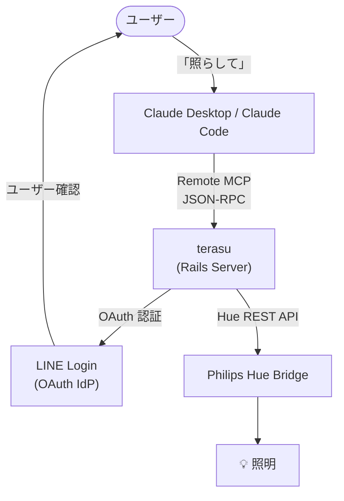
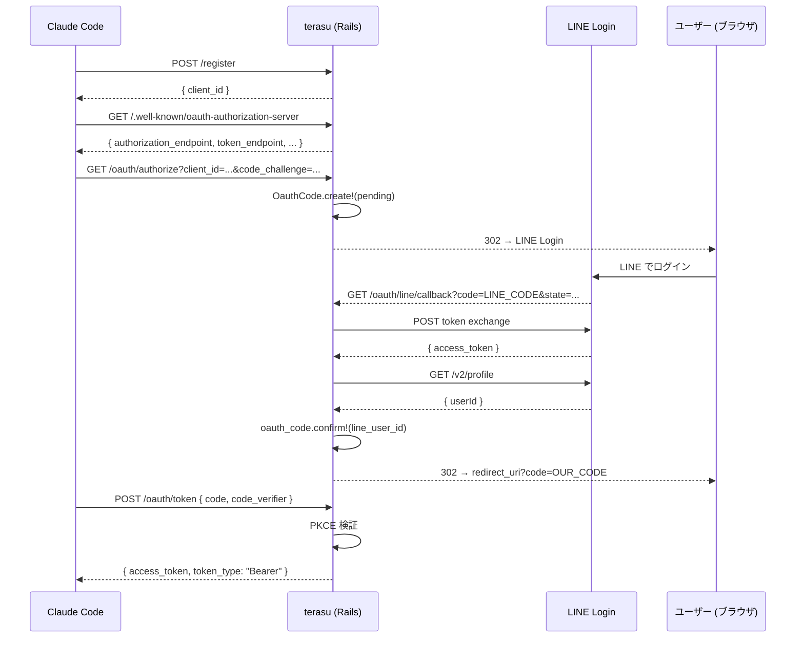
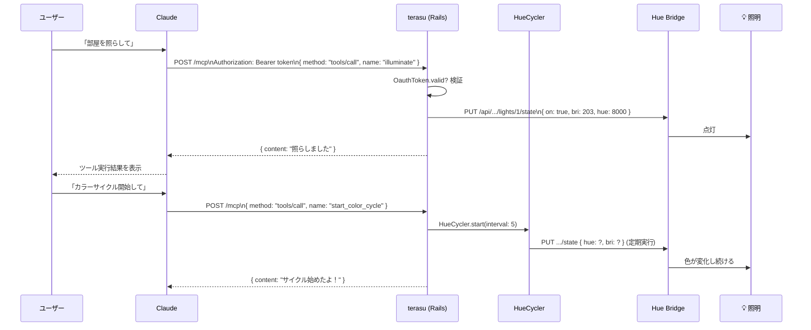
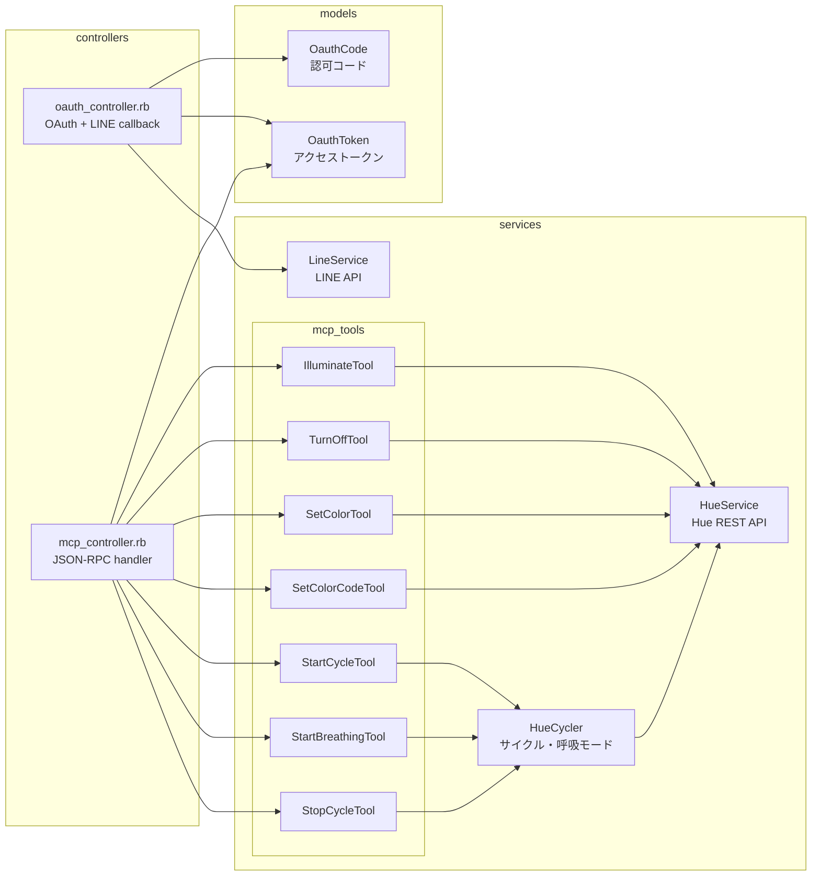
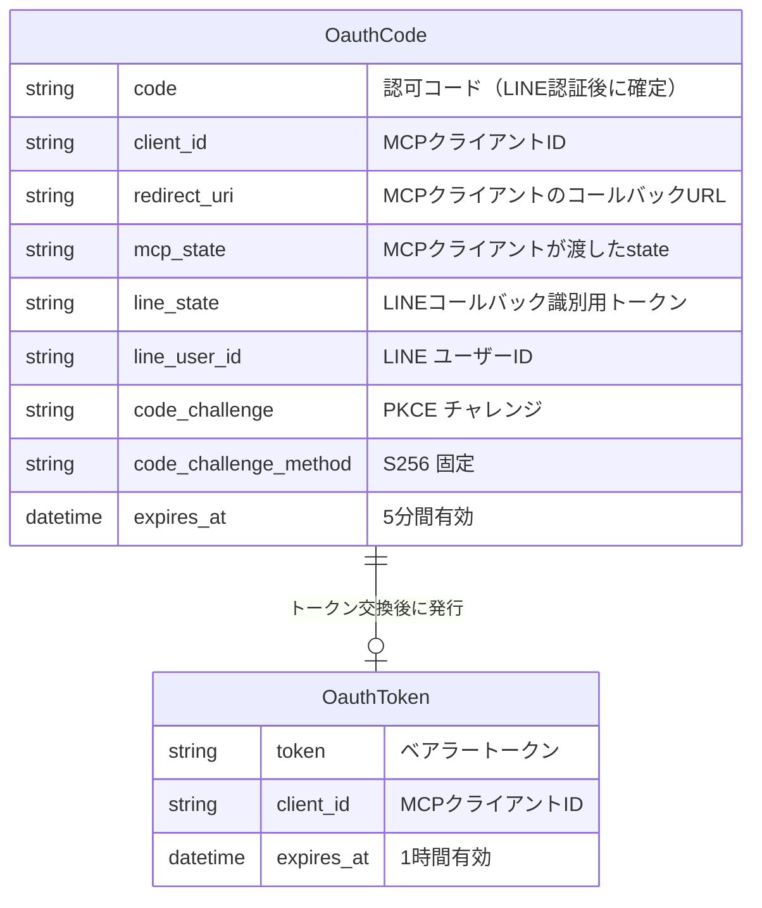

# ARCHITECTURE

terasu のシステム設計と実装の解説。

---

## システム概要

terasu は **Rails 製の Remote MCP Server** です。Claude などの AI クライアントが OAuth 2.0 で認証し、MCP プロトコルを通じて Philips Hue の照明を操作できます。

---

## 認証フロー

OAuth 2.0 Authorization Code Flow + PKCE で実装しています。認証基盤として LINE Login を使用し、Devise / Doorkeeper などの gem は使わず最小実装しています。

### 設計のポイント

- **セッション不使用**: Rails API モードはセッションを持たないため、認可コードを `OauthCode` テーブルで管理
- **PKCE (S256)**: コードインターセプト攻撃を防ぐため PKCE を実装
- **LINE Login を IdP として利用**: 独自のユーザー管理を持たず、LINE の認証に委譲

---

## MCP ツール呼び出しフロー

---

## ファイル構成

---

## DB スキーマ

---

## API エンドポイント一覧

| Method | Path | 説明 |
|--------|------|------|
| `GET`  | `/.well-known/oauth-protected-resource` | OAuth プロテクトリソースメタデータ |
| `GET`  | `/.well-known/oauth-authorization-server` | OAuth 認可サーバーメタデータ |
| `POST` | `/register` | Dynamic Client Registration (RFC 7591) |
| `GET`  | `/oauth/authorize` | 認可エンドポイント → LINE Login へリダイレクト |
| `GET`  | `/oauth/line/callback` | LINE Login コールバック |
| `POST` | `/oauth/token` | トークンエンドポイント |
| `GET`  | `/mcp` | MCP サーバー情報 |
| `POST` | `/mcp` | MCP JSON-RPC ハンドラ |
| `GET`  | `/mcp/sse` | SSE エンドポイント |

---

## MCP ツール一覧

| ツール名 | 引数 | 説明 |
|---------|------|------|
| `illuminate` | `brightness` (1-100), `color` (warm/cool) | 照明をつける |
| `turn_off_lights` | なし | 照明を消す |
| `set_light_color` | `color` (red/yellow/warm/green/blue/purple/pink) | 色を変える |
| `set_light_color_hex` | `hex` (#RRGGBB) | HEXカラーコードで色を指定する |
| `start_color_cycle` | `interval` (1-60秒), `brightness` (1-100) | 色を一定間隔で自動変化させる |
| `start_breathing` | `color` (red/yellow/.../pink), `speed` (slow/normal/fast) | 明るさが上下する呼吸モードを開始する |
| `stop_color_cycle` | なし | サイクル・呼吸モードをすべて停止する |
