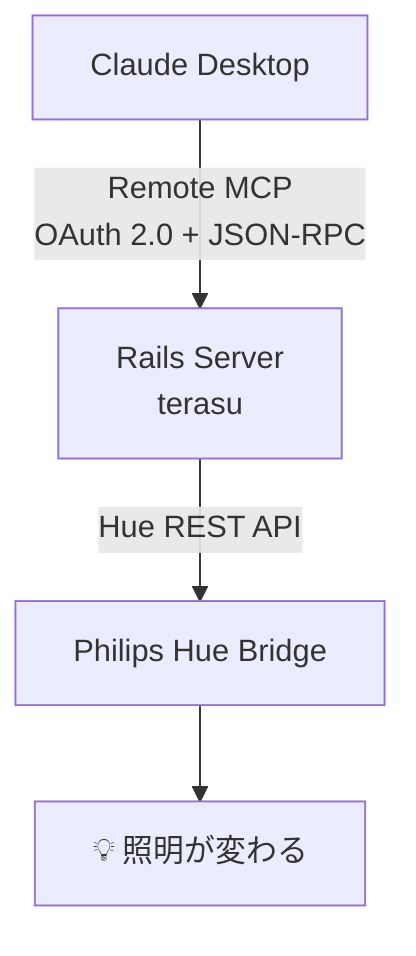
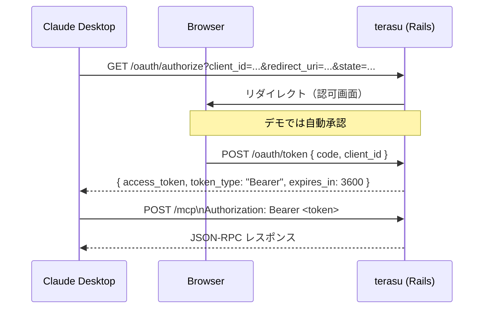
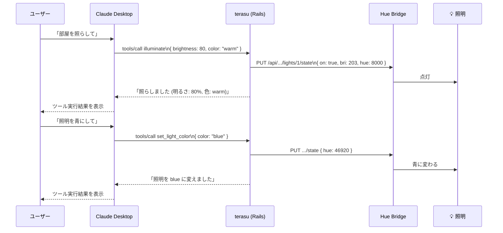

# terasu

Remote MCP Server built with Rails × Philips Hue API.

「照」: AI に声をかけたら、物理的に部屋が照らされる。

## Architecture



## MCP Tools

| Tool | 説明 |
|------|------|
| `illuminate` | 照明をつける（明るさ・色を指定可能）|
| `turn_off_lights` | 照明を消す |
| `set_light_color` | 照明の色を変える |
| `set_light_color_hex` | HEXカラーコード（#RRGGBB）で色を指定する |
| `start_color_cycle` | 色を一定間隔で自動変化させる |
| `start_breathing` | 明るさが上下する呼吸モードを開始する |
| `stop_color_cycle` | サイクル・呼吸モードをすべて停止する |

## Setup

### 環境変数

```
HUE_BRIDGE_IP=192.168.1.100   # Hue Bridge の IP アドレス
HUE_API_KEY=your-hue-api-key  # Hue API キー
HUE_LIGHT_ID=1                # コントロールするライト ID
HUE_MOCK=true                 # true にすると Hue API を叩かずログ出力のみ
```

### Hue API キーの取得

1. Bridge に接続した状態でブラウザから `http://<BRIDGE_IP>/debug/clip.html` を開く
2. URL に `/api` を入力し Body に `{"devicetype":"terasu"}` を POST
3. Bridge 本体のボタンを押してから再度 POST → API キーが返る

### 起動

```bash
bundle install
rails db:create db:migrate
HUE_MOCK=true rails server
```

## OAuth フロー



## MCP エンドポイント

```
GET  /mcp      # サーバー情報
GET  /mcp/sse  # SSE（クライアント接続用）
POST /mcp      # JSON-RPC ハンドラ
```

## Claude Desktop との連携

### 1. サーバーを起動する

```bash
HUE_MOCK=true rails server -p 3000
```

### 2. 設定ファイルを編集する

Claude Desktop の設定ファイルを開く。

```bash
# macOS
open ~/Library/Application\ Support/Claude/claude_desktop_config.json
```

以下を追記する。

```json
{
  "mcpServers": {
    "terasu": {
      "type": "http",
      "url": "http://localhost:3000/mcp"
    }
  }
}
```

### 3. Claude Desktop を再起動する

設定を保存して Claude Desktop を再起動すると、初回のみ OAuth 認証が走る。

### 4. 動作確認

Claude に話しかける。



### curl で直接確認する場合

```bash
# トークンを発行
TOKEN=$(rails runner "puts OauthToken.create!.token")

# ツール一覧
curl -s -X POST http://localhost:3000/mcp \
  -H "Authorization: Bearer $TOKEN" \
  -H "Content-Type: application/json" \
  -d '{"jsonrpc":"2.0","id":1,"method":"tools/list","params":{}}'

# illuminate を呼ぶ
curl -s -X POST http://localhost:3000/mcp \
  -H "Authorization: Bearer $TOKEN" \
  -H "Content-Type: application/json" \
  -d '{"jsonrpc":"2.0","id":2,"method":"tools/call","params":{"name":"illuminate","arguments":{"brightness":80,"color":"warm"}}}'
```
